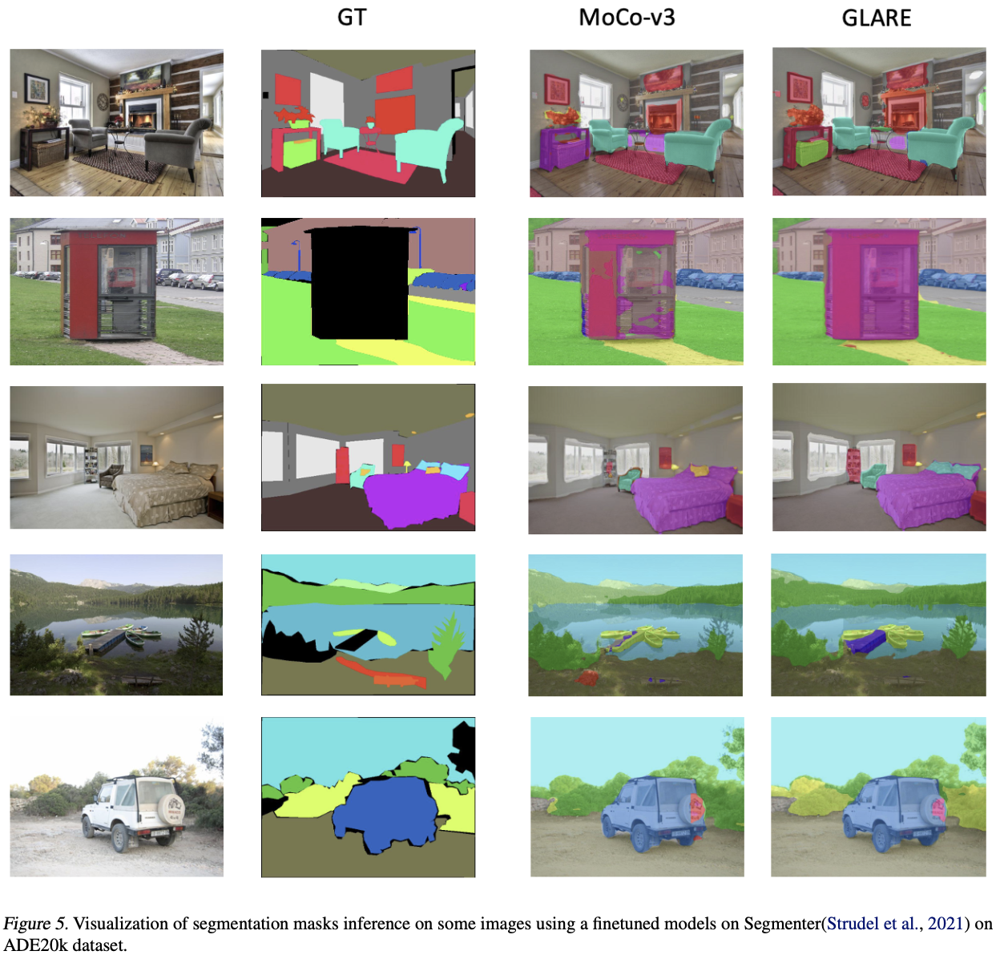

# glare-ssl
GLARE: Global, Local, and Regional Consistency Enforcement in Self-Supervised Learning for Enhanced Dense Recognition

### Additional Attention maps

### Visualization of semantic segmentation masks

### Additional results on COCO Object detection

### Results of GLARE on linear probing on ImageNet

### Semantic Segmentation on additional benchmark datasets

